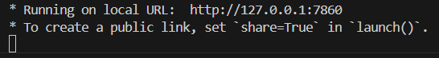

# Handbook for Automatic Text-to-Schema and Text-to-SQL Agents

**Contributions:**

* Text-to-Schema Agent: Ding Jiale
* Text-to-SQL Agent: Gong Yuehu
* Agent Evaluation: Qiu Zijie

## How to setup?

### Requirement
* Run our code on Windows;
* You need to enable miniconda and python (3.10) on your platform;
* To use our text-to-SQL agent, we provide guideline for MySQL-80 You need to connect the server by yourself.

### Guideline

1. Create a new conda environment for this project
```
conda create -n autoschema python=3.10 
```

2. Install required libs
```
conda activate autoschema
pip install -r requirements.txt
```

3. Enable your model by providing valid ```api-key```, ```base-url``` and ```model``` in ```/text2schema/utils.py```, ```/text2schema/evaluate.py```,```/text2sql/text2sql.py```.

## How to use Text-to-Schema Agent?

1. Start the GUI code.
```
cd text2schema
python text2schema.py
```

2. Run the code on your local URL, e.g.```http://127.0.0.1:7860```


3. As for the usage of our text2schema agent, please refer to the following DEMO ... (You may need to download the DEMO in ```text2schema/assets/demo.mp4``` by yourself and watch it.)

<video src="text2schema/assets/demo.mp4" autoplay="true" controls="controls"></video>

## How to use Text-to-SQL?

1. Connect the MySQL server by running ```net start mysql80``` in your command line.

2. Provide your server information and database in the ```text2sql/text2sql.py```.

3. Start the GUI code.
```
cd text2sql
python ./test2sql/text2sql.py
```

4. Run the code on your local URL, e.g.```http://127.0.0.1:7860```


5. The GUI has four windows:'Input', 'sql-output', 'text-output','mysql-output' and two buttons: 'Input confirm', 'Run sql'. Users could build a database, update the items and showcase the results. As for the usage of our text2schema agent, please refer to the following DEMO ... (You may need to download the DEMO in ```text2sql/assets/demo.mp4``` by yourself and watch it.)

<video src="text2sql/assets/demo.mp4" autoplay="true" controls="controls"></video>


